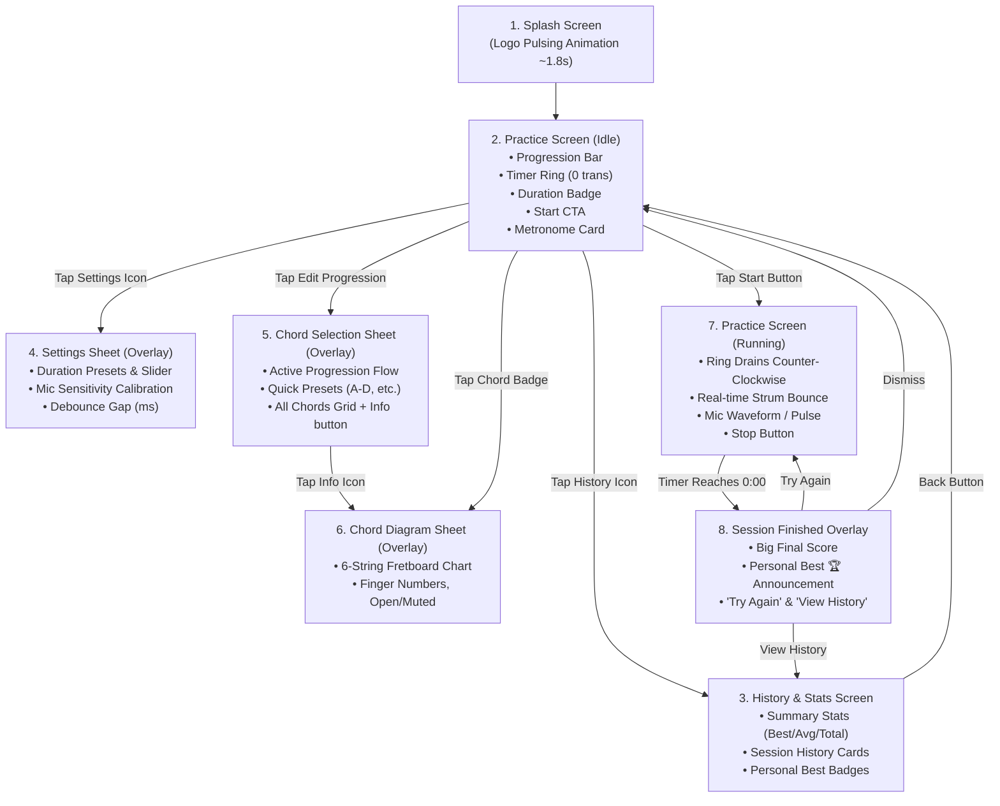

# 🎸 Chord Strum Counter — UI/UX Design Specification & Guidelines

> **Document Version:** 1.0  
> **Target Audience:** UI/UX Designers, Product Designers, Design System Engineers  
> **App Concept:** Hands-free acoustic guitar chord transition and strum counter with integrated metronome and progress tracking.  
> **Theme & Aesthetic Direction:** Warm Acoustic Guitar Wood (Mahogany, Rosewood, Honey Amber Varnish, Golden Brass, Ivory Inlays) — Cozy, Welcoming & Tactile.

---

## 📑 Table of Contents

1. [Product Overview & Value Proposition](#1-product-overview--value-proposition)
2. [Design Philosophy & Aesthetic Direction](#2-design-philosophy--aesthetic-direction)
3. [Design System Tokens & Palette](#3-design-system-tokens--palette)
4. [Information Architecture & Navigation Flow](#4-information-architecture--navigation-flow)
5. [Screen & Overlay Specifications](#5-screen--overlay-specifications)
   - [5.1 Splash Screen](#51-splash-screen)
   - [5.2 Practice Screen (Idle / Ready State)](#52-practice-screen-idle--ready-state)
   - [5.3 Practice Screen (Active / Listening State)](#53-practice-screen-active--listening-state)
   - [5.4 Session Finished Overlay](#54-session-finished-overlay)
   - [5.5 Chord Selection Bottom Sheet](#55-chord-selection-bottom-sheet)
   - [5.6 Chord Diagram Viewer Bottom Sheet](#56-chord-diagram-viewer-bottom-sheet)
   - [5.7 Settings & Audio Calibration Bottom Sheet](#57-settings--audio-calibration-bottom-sheet)
   - [5.8 Microphone Permission Modal Dialog](#58-microphone-permission-modal-dialog)
   - [5.9 Session History & Stats Screen](#59-session-history--stats-screen)
6. [Motion, Micro-interactions & Haptics](#6-motion-micro-interactions--haptics)
7. [Designer Checklist & Figma Asset Deliverables](#7-designer-checklist--figma-asset-deliverables)

---

## 1. Product Overview & Value Proposition

**Chord Strum Counter** is a dedicated mobile training tool designed for guitarists (from beginners practicing basic open chords to intermediate players building transition speed). 

### The Core Problem Solved
When practicing chord changes (e.g., transitioning between $A$ and $D$, or $C$ and $G$), guitarists must keep both hands on the instrument (fretting and strumming). In traditional practice methods, counting transitions manually distracts the player, and tapping a phone screen interrupts hand placement.

### Key Functional Capabilities
1. **Hands-Free Acoustic Strum Counting:** The app uses real-time microphone RMS amplitude detection to count each distinct chord strum automatically.
2. **Customizable Practice Session Timer:** Timed sprint intervals (default 1 minute; customizable from 15s to 5m) with always-on screen functionality.
3. **Integrated Acoustic Metronome:** Synthesized woodblock audio clicks with adjustable tempo ($40 - 240\text{ BPM}$), Italian tempo markings (*Andante*, *Allegro*, etc.), and a synchronized 4-beat visualizer with accented beat 1.
4. **Progression Builder & Interactive Fretboard Visualizer:** Select 2 to 6 chords, view guitar fretboard chord charts (finger numbers, open/muted strings, fret markers).
5. **Session History & Motivation Engine:** Tracks historical performance, calculating averages and highlighting progression-specific Personal Bests (🏆).

---

## 2. Design Philosophy & Aesthetic Direction

### Mood: "Acoustic Warmth & Luthier Craftsmanship"
The app should look and feel like an intimate acoustic session in a warm, wood-paneled room. It draws visual inspiration from the materials of fine handcrafted acoustic guitars:

* **Warm Tonewoods:** Rich, deep mahogany sides, aged dark rosewood fretboards, warm spruce soundboards, and Brazilian walnut backings.
* **Warm Amber & Honey Varnishes:** Lustrous golden-amber lacquer that catches warm room light.
* **Brass & Gold Hardware:** Warm metallic touches reminiscent of vintage tuning machines, frets, and strap pins.
* **Bone, Ivory & Mother-of-Pearl:** Soft, high-legibility off-white/cream inlays, nuts, and fret markers.
* **Cozy & Welcoming Atmosphere:** Soft radial glows (evoking a sunburst guitar finish), tactile cards, gentle organic curves, and calm, unhurried typography.

```
       ┌────────────────────────────────────────────────────────┐
       │                 ACOUSTIC AESTHETIC PALETTE             │
       ├─────────────────┬──────────────────┬───────────────────┤
       │   ROSEWOOD &    │   HONEY AMBER    │   IVORY & BONE    │
       │    MAHOGANY     │     VARNISH      │      INLAYS       │
       │   Dark woods    │  Primary accents │  Legible labels   │
       │  for background │   & golden glow  │  & crisp numbers  │
       └─────────────────┴──────────────────┴───────────────────┘
```

---

## 3. Design System Tokens & Palette

### 3.1 Color Palette (Dark Theme — Default Primary Experience)

| Token Name | Hex Code | Visual Reference | UI Role |
| :--- | :--- | :--- | :--- |
| `FretboardBlack` / `Background` | `#120E0D` | Dark Ebony Wood / Soundhole Depth | Main canvas background, deepest contrast |
| `SurfaceDark` | `#1E1211` | Dark Rosewood Plank | Base surface for elevated cards, bottom sheets |
| `SurfaceVariantDark` | `#2D1917` | Warm Mahogany Veneer | Secondary cards, chip backgrounds, stroke borders |
| `AmberGold` / `Primary` | `#FFB300` | Golden Amber Lacquer / Sunburst Gold | Primary buttons, active progress rings, key metrics, accents |
| `AmberLight` | `#FFE082` | Honey Glaze Highlight | Hover/pressed states, badge text, glowing edges |
| `RosewoodMid` / `Container` | `#5C1D1A` | Oiled Mahogany Body | Selected chip container, high-emphasis badge background |
| `RosewoodLight` | `#8A2E2A` | Cherry / Red Mahogany Accent | Sub-accents, border outlines, warning states |
| `IvoryBone` / `OnBackground` | `#FBF4EB` | Polished Bone Nut / Ivory Inlay | Primary text, titles, prominent counter figures |
| `SpruceCream` / `OnSurface` | `#D9C7B6` | Aged Alpine Spruce Soundboard | Secondary text, captions, inactive icons (60–70% alpha) |
| `StringBronze` | `#C4A482` | Phosphor Bronze Wound Strings | Inactive slider tracks, fretboard string graphics, subtle dividers |
| `EmberCrimson` / `Error` | `#D32F2F` | Fiery Amber Crimson | "Stop" practice button, muted string '✕' marker |
| `EmeraldGreen` / `Success` | `#43A047` | Forest Green / Vintage Pearl | "Personal Best 🏆" badge, success confirmations |

### 3.2 Color Palette (Light Theme — Warm Acoustic Studio)

| Token Name | Hex Code | Visual Reference | UI Role |
| :--- | :--- | :--- | :--- |
| `SurfaceLight` | `#FFF8F0` | Unfinished Spruce / Blonde Maple | Light background canvas, soft warm cream |
| `SurfaceVariantLight`| `#F4EAE0` | Sanded Cedar / Warm Linen | Card containers, bottom sheets |
| `RosewoodDarkAccent` | `#4A1E1B` | Polished Rosewood Trim | Primary text, titles, deep contrast elements |
| `AmberWarmLight` | `#E67C00` | Warm Caramel / Amber Varnish | Primary interactive buttons, active rings, key accents |
| `OnSurfaceMuted` | `#7A665A` | Walnut Dust | Secondary labels, hints, inactive controls |

### 3.3 Typography

* **Display & Brand Headers:** Warm, stylish, modern serif or humanistic sans-serif (e.g. *Fraunces*, *Playfair Display*, *Instrument Serif*, or *Plus Jakarta Sans*).
* **Numerical Metrics (Timer, Transitions, BPM):** Monospaced / Tabular Figures (e.g. *Space Grotesk*, *JetBrains Mono*, or *Inter Tabular Numbers*) to ensure numbers don't jump or wobble during rapid animations.
* **Body, Controls & Labels:** Clean, legible sans-serif (e.g. *Plus Jakarta Sans*, *Inter*, *Outfit*) with weights ranging from Regular (400) to ExtraBold (800).

```
Type Scale Hierarchy:
• Display / Giant Counter: 68sp – 88sp (ExtraBold, Tabular Figures)
• Headline Large (Title): 28sp – 32sp (Bold / Serif / Heavy Sans)
• Title Medium (Section): 18sp – 20sp (SemiBold)
• Body Large: 16sp (Regular / Medium)
• Body Small / Caption: 12sp – 14sp (Medium / SemiBold)
• Micro / Badges: 10sp – 11sp (Bold, Uppercase / Compact)
```

### 3.4 Corner Radius & Elevation Scale

* **Pills / Badges:** Full Round (`999dp`)
* **Cards / Panels:** `16dp` – `20dp`
* **Bottom Sheets:** Top corners `24dp`
* **Chord Diagram Box:** `16dp`
* **Shadows / Glows:** Warm amber ambient shadows (`rgba(255, 179, 0, 0.12)`) and deep wood drop shadows (`rgba(18, 14, 13, 0.4)`).

---

## 4. Information Architecture & Navigation Flow



---

## 5. Screen & Overlay Specifications

---

### 5.1 Splash Screen

**Purpose:** Warm, inviting entry point that welcomes the musician into their practice space while the audio engine and preferences initialize.

#### Visual Elements & Layout
* **Background:** Deep mahogany warm tone (`#2D1B19` / `#1E1211`) with a subtle radial vignette.
* **Central Brand Mark:**
  * Acoustic guitar / soundhole icon or warm branded emblem.
  * Encased in an organic warm glow container (`192dp × 192dp`).
  * **Animation:** Rhythmic heartbeat / breathing pulse (smooth sinusoidal scaling between `0.90x` and `1.15x` every `500ms`).
* **App Title (Optional):** "Chord Strum Counter" in golden amber warm typography.
* **Duration:** Approximately $1.8\text{ seconds}$ before a smooth crossfade into the Practice Screen.

---

### 5.2 Practice Screen (Idle / Ready State)

**Purpose:** The central dashboard of the app where the guitarist prepares their session, reviews their chord progression, sets duration, adjusts the metronome, and launches practice.

```
┌────────────────────────────────────────────────────────┐
│ [🏆 History]                        [⚙️ Settings]      │
│                   Chord Transitions                    │
│                                                        │
│  ┌──────────────────────────────────────────────────┐  │
│  │  [ A ] ➔ [ D ]                       [✏️ Edit]   │  │
│  └──────────────────────────────────────────────────┘  │
│                                                        │
│                     ╭──────────╮                       │
│                  ╭──╯          ╰──╮                    │
│                 │        0         │                   │
│                 │   transitions    │                   │
│                  ╰──╮          ╭──╯                    │
│                     ╰──────────╯                       │
│                                                        │
│                  Duration: 1 min                       │
│                                                        │
│              ╔════════════════════════╗                │
│              ║     START PRACTICE     ║                │
│              ╚════════════════════════╝                │
│                                                        │
│  ┌──────────────────────────────────────────────────┐  │
│  │ (🔊)  Metronome        80 BPM · Andante   [ON/OFF]│ │
│  │       ●       ○       ○       ○                  │  │
│  │   [-5]  [-1]     80 BPM     [+1]  [+5]           │  │
│  │   ───●────────────────────────────               │  │
│  └──────────────────────────────────────────────────┘  │
└────────────────────────────────────────────────────────┘
```

#### Detailed Element Breakdown

1. **Top Bar Area:**
   - **Left Action Button:** History icon button (`Icons.Default.History`), soft circular hover ripple, navigates to Session History.
   - **Right Action Button:** Settings gear icon button (`Icons.Default.Settings`), opens Settings Bottom Sheet.
   - **Screen Subtitle:** "Chord Transitions" in soft ivory (`60%` opacity).

2. **Active Chord Progression Bar:**
   - **Container:** Rounded pill/card (`RoundedCornerShape(16dp)`), warm mahogany tinted surface (`#2D1917`).
   - **Interactive Chord Badges:**
     - Each chord (e.g. `A`, `D`) displayed in a tactile chip (`#5C1D1A` fill, `#FFE082` text, `RoundedCornerShape(8dp)`).
     - **Interactivity:** Tapping any chord chip immediately opens the **Chord Diagram Sheet** for instant finger placement verification.
   - **Flow Arrows:** Golden or warm muted arrow icons (`➔`) between chords.
   - **Edit Progression Button:** Pencil icon (`✏️`) on the right end; triggers the **Chord Selection Sheet**.

3. **Central Practice Ring & Strum Counter (`TimerRing`):**
   - **Ring Geometry:** `220dp × 220dp` circular progress indicator with `10dp` stroke thickness.
   - **Tracks:**
     - *Background Track:* Soft dark wood (`#2D1917`).
     - *Active Track:* Bright golden amber (`#FFB300`) with rounded stroke caps. (Full $100\%$ ring in idle).
   - **Center Typography:**
     - Giant Count Display: "0" in `68sp` ExtraBold ivory text (`#FBF4EB`).
     - Subtitle: "transitions" in soft cream (`60%` opacity).

4. **Duration Indicator:**
   - Text display: "Duration: 1 min" (or currently selected duration) in golden amber.

5. **Primary Call To Action (Start Button):**
   - **Style:** Large pill button (`Height: 52dp`, `Width: 65%` of screen).
   - **Color:** Golden Amber background (`#FFB300`), dark fretboard text (`#120E0D`), `FontWeight.Bold`.
   - **Label:** "Start" or "Start Practice 🎸".
   - **Haptics:** Light click feedback on press. Checks microphone permissions before starting.

6. **Integrated Acoustic Metronome Card (`MetronomeBottomCard`):**
   - **Container:** Elevated card (`RoundedCornerShape(20dp)`), dark rosewood finish.
   - **Header Row:**
     - Circular Icon Badge: Graphic EQ / Metronome icon in gold/amber.
     - Title & Tempo: "Metronome" (Bold) and "$80\text{ BPM} \cdot \text{Andante}$" (Active tempo name updates dynamically).
     - Master On/Off Switch: High-contrast toggle switch.
   - **Beat Visualizer (when active):**
     - 4-beat dot row (`● ○ ○ ○`).
     - *Beat 1 (Accented Downbeat):* Larger dot (`14dp`), brilliant golden amber flash + scale spring to `1.45x`.
     - *Beats 2, 3, 4:* Standard dots (`11dp`), amber flash + scale spring to `1.25x`.
     - *Inactive dots:* Soft dark wood fill.
   - **Expandable Tempo Controls (Accordion or expanded when ON):**
     - Quick Step Buttons: Tactile tonal icon buttons for `[-5]`, `[-1]`, `[+1]`, `[+5]`.
     - Big BPM Readout: Centered `HeadlineSmall` bold amber number (e.g. "80").
     - Smooth Tempo Slider: Ranging from $40\text{ BPM}$ to $240\text{ BPM}$.
     - Range Endpoint Labels: "40 (Largo)" on left, "240 (Presto)" on right.

---

### 5.3 Practice Screen (Active / Listening State)

**Purpose:** Minimal-distraction, highly legible performance view while the guitarist is playing. Screen remains awake throughout.

```
┌────────────────────────────────────────────────────────┐
│ [🔒 Top Bar Hidden / Non-interactive during session]   │
│                                                        │
│  ┌──────────────────────────────────────────────────┐  │
│  │  [ A ] ➔ [ D ]                    (Session Active)│ │
│  └──────────────────────────────────────────────────┘  │
│                                                        │
│                     ╭───████───╮   ◄─ Progress drains  │
│                  ╭──╯          ╰──╮                    │
│                 │       37         │ ◄─ Bounces on     │
│                 │      0:42        │    each strum!    │
│                  ╰──╮          ╭──╯                    │
│                     ╰──────────╯                       │
│                                                        │
│                 🎙  Listening for strums…              │
│                     ~ ~ (( 🎸 )) ~ ~                   │
│                                                        │
│              ╔════════════════════════╗                │
│              ║          STOP          ║                │
│              ╚════════════════════════╝                │
│                                                        │
│  ┌──────────────────────────────────────────────────┐  │
│  │ (🔊)  Metronome        80 BPM · Andante    [ ON ] │ │
│  │       ●       ○       ○       ○                  │  │
│  └──────────────────────────────────────────────────┘  │
└────────────────────────────────────────────────────────┘
```

#### Behavioral & Visual Changes During Active Practice
1. **Screen Awakening:** Android `FLAG_KEEP_SCREEN_ON` activated automatically.
2. **Timer Ring Animation:** The golden arc drains smoothly counter-clockwise matching the remaining seconds (e.g. $60\text{s} \to 0\text{s}$).
3. **Strum Counter Spring Dynamics:**
   * On every acoustic strum detected by the mic:
     - The counter number smoothly scales up from `1.0x` to `1.35x` with a bouncy spring animation (`DampingRatioMediumBouncy`) and returns to `1.0x` in `120ms`.
     - Physical haptic tick triggers simultaneously (`HapticFeedbackType.TextHandleMove`).
4. **Time Remaining Display:** The text below the transition count displays live formatted countdown (e.g., `0:42`, `0:15`, `9s`).
5. **Acoustic Listening Waveform / Mic Indicator:**
   * Gentle pulsing microphone icon with expanding acoustic sound waves.
   * Text: "🎸 Listening for strums…".
6. **Stop Action Button:**
   * The "Start" button transitions into an outlined or soft crimson "Stop" button (`#D32F2F`) allowing the user to cancel or abort the session early.

---

### 5.4 Session Finished Overlay

**Purpose:** Celebratory post-practice summary overlay that provides instant gratification, score feedback, and personal best recognition.

```
┌────────────────────────────────────────────────────────┐
│                                                        │
│                   Time's up! 🎸                        │
│                                                        │
│                 [ A ] ➔ [ D ]                          │
│                                                        │
│                     ╭──────────╮                       │
│                     │    54    │ ◄─ Giant Gold Score   │
│                     ╰──────────╯                       │
│                   chord transitions                    │
│                                                        │
│               ╔══════════════════════════╗             │
│               ║   🏆 Personal Best!      ║             │
│               ╚══════════════════════════╝             │
│                                                        │
│              ╔════════════════════════════╗            │
│              ║         TRY AGAIN          ║            │
│              ╚════════════════════════════╝            │
│              ┌────────────────────────────┐            │
│              │        View History        │            │
│              └────────────────────────────┘            │
└────────────────────────────────────────────────────────┘
```

#### Elements & Features
1. **Backdrop:** Full-screen translucent warm dark scrim (`#120E0D` at `95%` opacity with background blur).
2. **Title:** "Time's up! 🎸" in warm headline typography.
3. **Progression Summary:** Badges showing the exact chord sequence practiced (e.g. `A ➔ D`).
4. **Massive Score Display:**
   - Giant transition count in `88sp` ExtraBold golden amber (`#FFB300`).
   - Subtitle: "chord transitions".
5. **Personal Best (🏆) Banner:**
   - *Intelligent logic:* Evaluated specifically against prior sessions matching the **same chord progression** and **same duration**.
   - If the user achieves a new high score or matches their record, a celebratory golden/emerald badge appears: "🏆 Personal Best!".
6. **Action CTAs:**
   - **"Try Again" (Primary Button):** Full-width golden amber button. Restarts a new session immediately with identical settings so the user doesn't have to reconfigure anything.
   - **"View History" (Secondary Button):** Outlined warm button navigating to the session log.

---

### 5.5 Chord Selection Bottom Sheet

**Purpose:** Comprehensive drawer for customizing the active practice chord progression (2 to 6 chords) or picking proven starter presets.

```
┌────────────────────────────────────────────────────────┐
│                        ══════                          │
│               🎸 Select Practice Chords                │
│                                                        │
│  Current Progression: A ➔ D ➔ E                        │
│                                                        │
│  QUICK PRESETS                                         │
│  ┌───────────┐ ┌───────────────┐ ┌───────────────────┐ │
│  │  A ⇄ D    │ │  A ⇄ D ⇄ E   │ │  C ⇄ G ⇄ Am       │ │
│  └───────────┘ └───────────────┘ └───────────────────┘ │
│                                                        │
│  CHORD LIBRARY                                         │
│  (Tap chip to toggle, tap ℹ to view fretboard diagram) │
│                                                        │
│  [✓ A   ℹ]  [✓ D   ℹ]  [✓ E   ℹ]  [  C   ℹ]  [  G   ℹ] │
│  [  Am  ℹ]  [  Em  ℹ]  [  Dm  ℹ]  [  Bm  ℹ]  [  F   ℹ] │
│  [  A7  ℹ]  [  C7  ℹ]  [  D7  ℹ]  [  E7  ℹ]  [  G7  ℹ] │
│                                                        │
│  ╔═══════════════════════════════════════════════════╗ │
│  ║          Confirm Selection (3 Chords)             ║ │
│  ╚═══════════════════════════════════════════════════╝ │
└────────────────────────────────────────────────────────┘
```

#### Detailed Breakdown
1. **Drag Handle & Header:** Standard bottom sheet drag pill with title "🎸 Select Practice Chords".
2. **Current Sequence Bar:** Live preview showing the selected sequence: "Current Progression: A ➔ D ➔ E".
3. **Quick Presets Section:**
   - Tonal pill buttons for common beginner/intermediate transitions:
     - `A ⇄ D` (Classic two-chord beginner sprint)
     - `A ⇄ D ⇄ E` (Standard I-IV-V rock/blues progression)
     - `C ⇄ G ⇄ Am` (Folk / Pop staple)
     - `Em ⇄ Am` (Smooth minor transition)
4. **Complete Chord Library Flow/Grid:**
   - Categorized chords (Major, Minor, Dominant 7th).
   - **Interactive Filter Chips:**
     - *Unselected:* Dark surface with ivory text.
     - *Selected:* Golden amber container with dark text and a checkmark (`✓`).
     - *Inline Diagram Trigger:* An info icon (`ℹ`) on the trailing edge of each chip. Tapping `ℹ` opens the **Chord Diagram Viewer Sheet** directly without closing selection.
   - *Selection Limits:* Minimum 1–2 chords, maximum 6 chords.
5. **Confirm Button:** Sticky bottom CTA "Confirm Selection (N Chords)".

---

### 5.6 Chord Diagram Viewer Bottom Sheet

**Purpose:** Visual fretboard reference displaying exact finger positioning, fret numbers, and open/muted string rules.

```
┌────────────────────────────────────────────────────────┐
│                        ══════                          │
│                         Am                             │
│                       A Minor                          │
│                                                        │
│             ✕   O                   O                  │
│           ═════════════════════════════  ◄─ Nut (fret 0)
│           │   │   │   │   ●(1)│   │                    │
│           ─────────────────────────────  ◄─ Fret 1     │
│           │   │   ●(2)●(3)│   │   │                    │
│           ─────────────────────────────  ◄─ Fret 2     │
│           │   │   │   │   │   │   │                    │
│           ─────────────────────────────  ◄─ Fret 3     │
│           │   │   │   │   │   │   │                    │
│           ─────────────────────────────  ◄─ Fret 4     │
│             E   A   D   G   B   e                      │
│             6   5   4   3   2   1                      │
│                                                        │
│                    ┌─────────────┐                     │
│                    │    Close    │                     │
│                    └─────────────┘                     │
└────────────────────────────────────────────────────────┘
```

#### Graphic & Architectural Specifications
1. **Chord Header:** Bold Chord Symbol (e.g. `Am`, `32sp`) + Full Descriptive Name ("A Minor", `16sp`).
2. **Fretboard Canvas:**
   - **Fretboard Container:** Dark wood card (`220dp × 240dp`) with rounded corners.
   - **Nut Bar:** Thick top horizontal bar (`6px`) when chord is in open position (`baseFret == 1`). If capoed/higher fret, displays fret index label on the left (e.g. "3fr").
   - **Fret Wires:** 4 horizontal fret lines in bronze/silver (`2px`).
   - **Strings (6 vertical lines):**
     - Realistic gauge variation: String 6 (low E) is thickest (`4.5px`), down to String 1 (high e) which is thinnest (`1.2px`).
     - Strings rendered in phosphor bronze / string silver tones.
   - **Top Status Markers:**
     - **Muted String:** Red `✕` icon above the nut (indicates strings that must not be strummed).
     - **Open String:** Golden hollow circle `⭕` above the nut (strummed unfretted).
   - **Finger Position Dots:**
     - Amber filled circles positioned precisely between frets.
     - Inscribed Finger Number inside dot: `1` (Index), `2` (Middle), `3` (Ring), `4` (Pinky).
   - **String Pitch Names (Bottom):** `E` (6th), `A` (5th), `D` (4th), `G` (3rd), `B` (2nd), `e` (1st).
3. **Close Button:** Simple dismissal button.

---

### 5.7 Settings & Audio Calibration Bottom Sheet

**Purpose:** Fine-tuning session duration, microphone sensitivity, and audio debouncing to adapt to different guitar types (acoustic, classical, electric unplugged) and noisy environments.

```
┌────────────────────────────────────────────────────────┐
│                        ══════                          │
│                                                        │
│  ⏱  PRACTICE DURATION                                  │
│  ┌───────┐  ┌─────────┐  ┌───────┐  ┌─────────┐        │
│  │  30s  │  │  1 min  │  │  90s  │  │  2 min  │        │
│  └───────┘  └─────────┘  └───────┘  └─────────┘        │
│  Custom: 1m 15s                                        │
│  15s ───●────────────────────────────────── 5 min      │
│                                                        │
│  🎙  MIC SENSITIVITY                                   │
│  Medium — normal strumming                             │
│  Loud only ─────────●────────────────────── Very quiet │
│                                                        │
│  ⚡  MIN. GAP BETWEEN STRUMS (DEBOUNCE)                │
│  350 ms                                                │
│  100ms (fast) ────────●──────────────────── 800ms      │
│                                                        │
└────────────────────────────────────────────────────────┘
```

#### Sections & Controls
1. **Practice Duration:**
   - Quick preset buttons: `[30s]`, `[1 min]` (highlighted), `[90s]`, `[2 min]`.
   - Continuous slider ($15\text{s}$ to $300\text{s} / 5\text{ min}$) with real-time text readout.
2. **Microphone Sensitivity Calibration:**
   - Explanatory feedback text that adapts dynamically as the slider moves:
     - $< 33\%$: *"Low — only loud strums"* (ideal for loud acoustic or noisy rooms).
     - $33\% - 67\%$: *"Medium — normal strumming"* (standard default).
     - $> 67\%$: *"High — catches quiet strums"* (ideal for nylon/classical or quiet fingertip strums).
   - Continuous slider with labels *"Loud only"* $\longleftrightarrow$ *"Very quiet"*.
3. **Strum Debounce Gap (Minimum time between strum detections):**
   - Live millisecond readout (e.g. `350 ms`).
   - Range: $100\text{ ms}$ (super fast strumming) to $800\text{ ms}$ (slow deliberate transitions).
   - Prevents double-triggering on pick scrape or reverberant sound decay.

---

### 5.8 Microphone Permission Modal Dialog

**Purpose:** Transparent, privacy-conscious permission prompt that explains why audio access is needed.

#### Content & Copy
* **Title:** "Microphone Required 🎙"
* **Icon:** Warm microphone with musical note badge.
* **Body Copy:**  
  *"Chord Strum Counter uses the microphone exclusively to detect acoustic guitar strums and count chord transitions hands-free in real time. Your audio is analyzed locally on-device and is never recorded, saved, or uploaded."*
* **Buttons:**
  - **Confirm:** "Grant Access" / "Open Settings" (Primary golden amber button).
  - **Dismiss:** "Not Now" (Text button).

---

### 5.9 Session History & Stats Screen

**Purpose:** Motivation hub showing long-term practice consistency, historical progression records, and personal best highlights.

```
┌────────────────────────────────────────────────────────┐
│ [←] Session History                                    │
│                                                        │
│  ┌──────────────────────────────────────────────────┐  │
│  │     🏆 Best          📊 Average       🎸 Sessions │  │
│  │        62                44               28      │  │
│  └──────────────────────────────────────────────────┘  │
│  ────────────────────────────────────────────────────  │
│                                                        │
│  ┌──────────────────────────────────────────────────┐  │
│  │ [ A ] ➔ [ D ]                    62  🏆 Best     │  │
│  │ 30 Aug 2026, 14:15 · 1 min                       │  │
│  └──────────────────────────────────────────────────┘  │
│                                                        │
│  ┌──────────────────────────────────────────────────┐  │
│  │ [ C ] ➔ [ G ] ➔ [ Am ]           48              │  │
│  │ 29 Aug 2026, 19:30 · 1 min                       │  │
│  └──────────────────────────────────────────────────┘  │
│                                                        │
│  ┌──────────────────────────────────────────────────┐  │
│  │ [ Em ] ➔ [ Am ]                  39              │  │
│  │ 28 Aug 2026, 10:10 · 45s                         │  │
│  └──────────────────────────────────────────────────┘  │
└────────────────────────────────────────────────────────┘
```

#### Detailed Breakdown
1. **Top Bar:** Back arrow navigation + "Session History" title.
2. **Top Stats Overview Bar (`StatsBar`):**
   - 3 Key Metrics displayed horizontally in distinct columns:
     - 🏆 **Best:** All-time single-session transition record (e.g. `62`).
     - 📊 **Average:** Average transitions across all logged sessions (e.g. `44`).
     - 🎸 **Sessions:** Total lifetime practice sessions completed (e.g. `28`).
3. **Session Cards List (`LazyColumn`):**
   - Each card represents a saved session:
     - **Left Column:**
       - Chord progression badges with arrows (`[ A ] ➔ [ D ]`).
       - Formatted Date & Time: *"30 Aug 2026, 14:15"*.
       - Duration: *"1 min"* or *"45s"*.
     - **Right Column:**
       - Giant transition number (e.g. `62`).
       - If it is the user's personal best for that progression: A golden pill badge **"🏆 Best"** with celebratory styling.
4. **Empty State View:**
   - Displayed when no sessions exist yet.
   - Large cozy acoustic guitar illustration.
   - Title: *"No sessions yet"*.
   - Body: *"Complete your first practice session to see your progress and personal bests here."*

---

## 6. Motion, Micro-interactions & Haptics

### 6.1 Spring Animations
* **Strum Bounce:** On each detected audio strum, the counter number springs up to `1.35x` scale with `Spring.DampingRatioMediumBouncy` and `Spring.StiffnessHigh`, settling back down within $120\text{ms}$.
* **Metronome Pulse:** Beat dots scale up smoothly on each audio tick ($1.45x$ for Beat 1 downbeat, $1.25x$ for regular beats).

### 6.2 Haptic Feedback Map
* **Strum Detection:** Light text-handle tick (`TextHandleMove`) on every acoustic strum.
* **Metronome Toggle:** Firm press click (`LongPress`).
* **BPM Step (+/-):** Subtle click on stepper taps.
* **Session Complete:** Double celebratory haptic burst.

### 6.3 Sound & Metronome Audio Profile
* Metronome tones are procedurally generated at low latency using Android `AudioTrack`:
  * *Accented Beat 1:* High woodblock pitch ($1760\text{ Hz}$).
  * *Beats 2, 3, 4:* Low woodblock pitch ($880\text{ Hz}$).
  * Rich, organic woodblock acoustic timber.

---

## 7. Designer Checklist & Figma Asset Deliverables

When preparing the Figma / design system library for the engineering team, please provide the following structured components:

### 1. Color Swatches & Tokens
- [ ] Dark Mode Wood Palette (`Background`, `SurfaceDark`, `SurfaceVariantDark`, `RosewoodMid`, `AmberGold`, `AmberLight`, `IvoryBone`, `SpruceCream`, `EmberCrimson`, `EmeraldGreen`).
- [ ] Light Mode Acoustic Palette (`SurfaceLight`, `SurfaceVariantLight`, `RosewoodDarkAccent`, `AmberWarmLight`).

### 2. Typography Hierarchy & Components
- [ ] Large Counter Display numbers (Tabular figures, 68sp and 88sp).
- [ ] Title Medium, Body Large, Body Small, Caption, and Pill labels.

### 3. Reusable UI Components
- [ ] **Chord Badge:** Default, Selected, In-Progression arrow states.
- [ ] **Timer Ring:** Idle ($100\%$), Half-way ($50\%$), Near End ($10\%$).
- [ ] **Metronome Card:** Collapsed, Expanded, Active Playing (with 4-dot visualizer states for Beat 1 vs Beats 2–4).
- [ ] **Fretboard Diagram Canvas:** Standard 4-fret chart with nut line, muted string marker `✕`, open marker `⭕`, and numbered finger dots `(1)`, `(2)`, `(3)`, `(4)`.
- [ ] **History Session Card:** Normal card & "🏆 Personal Best" highlighted card.
- [ ] **Quick Preset Chips:** Active, Inactive, Pressed.

### 4. Vector Icons & Illustrations
- [ ] Custom or refined iconography: Acoustic Guitar, Soundhole Rosette, Metronome / Waveform, Microphone with pulse rings, Trophy 🏆, Fretboard chart icon.
- [ ] Empty State Illustration: Warm acoustic guitar resting on a wooden stand in a cozy room with soft lighting.
- [ ] App Launcher Icon: Circular guitar soundhole/strings with golden amber rim on dark rosewood background.

---

*This document serves as the complete functional and aesthetic specification for Chord Strum Counter. For questions or design token handoff clarifications, refer to the Android Jetpack Compose codebase under `dev.pablocoding.contadorderasgueosdeacordes`.*
