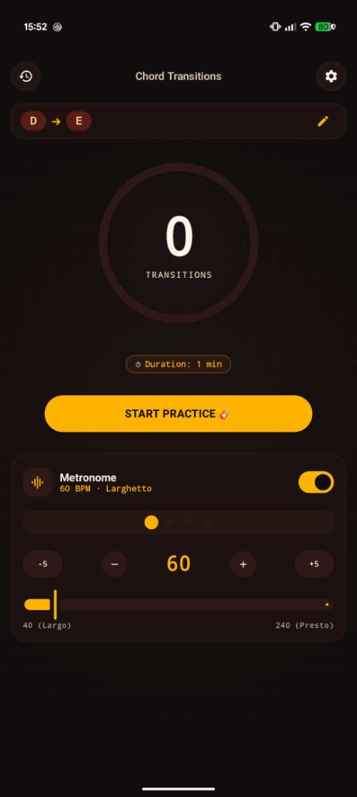
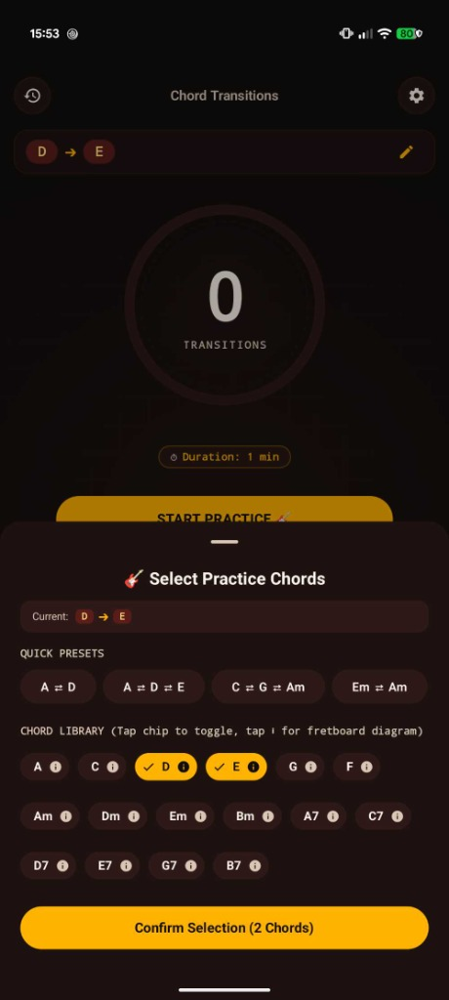
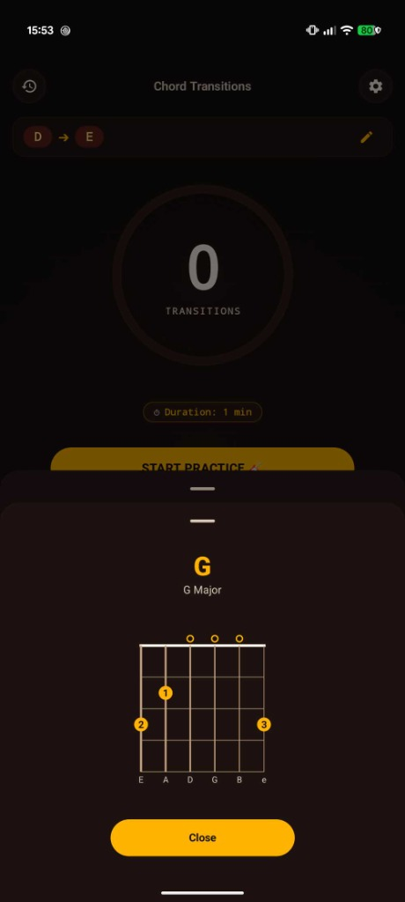
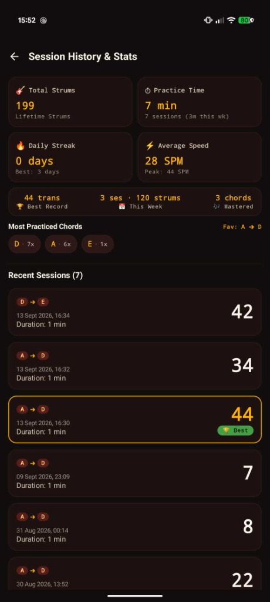

# 🎸 Chord Strum Counter

An Android application built with **Kotlin**, **Jetpack Compose**, and **Clean Architecture** to help guitarists practice chord transitions and strum speed automatically without taking hands off the guitar.

---

## 📱 Screenshots

| Practice & Metronome | Chord Selection | Fretboard Diagrams | History & Stats |
| :---: | :---: | :---: | :---: |
|  |  |  |  |

---

## ✨ Features

- 🎙 **Microphone-Based Strum Detection:** Automatically counts chord strums in real time using PCM audio amplitude (RMS) analysis and configurable sensitivity.
- ⏱ **Customizable Practice Timer:** Set practice sessions from 15 seconds to 5 minutes (default 1 minute) with an always-on screen mode and circular progress ring.
- 🎼 **Built-in Metronome:**
  - Low-latency procedural audio synthesis using `AudioTrack` (woodblock/click tones, accented beat 1).
  - Customizable tempo from 40 to 240 BPM with quick steppers (`-5`, `-1`, `+1`, `+5`) and smooth slider.
  - Real-time 4-beat visualizer pulsing in sync with the audio.
- 🎸 **Chord Library & Fretboard Diagrams:**
  - Fast chord pair and progression selection with popular presets (e.g., A ⇄ D, C ⇄ G ⇄ Am).
  - Visual fretboard diagrams with exact fingerings, open strings, and muted markers.
- 🏆 **Session History & Personal Bests:** Local database tracking practice history, average transitions, and personal best records.
- 🎨 **Guitar-Inspired UI & Animations:**
  - Rosewood / mahogany dark theme with warm amber/gold accents.
  - Animated pulsing launcher icon & splash screen.
  - Spring-animated counter scale bouncing on each detected strum with haptic feedback.

---

## 🛠 Tech Stack & Architecture

- **Language:** [Kotlin](https://kotlinlang.org/) (2.2.x)
- **UI Framework:** [Jetpack Compose](https://developer.android.com/jetpack/compose) with Material 3
- **Architecture:** Clean Architecture (Domain, Data, Presentation layers)
- **Dependency Injection:** [Hilt](https://dagger.dev/hilt/)
- **Database:** [Room](https://developer.android.com/training/data-storage/room)
- **Preferences:** [DataStore Preferences](https://developer.android.com/topic/libraries/architecture/datastore)
- **Concurrency & Reactivity:** Kotlin Coroutines & Flow (`StateFlow`, `SharedFlow`)
- **Audio Processing:** Android `AudioRecord` (mic strum detector) & `AudioTrack` (metronome synthesizer)

---

## 🚀 Getting Started

### Prerequisites
- Android Studio Hedgehog | 2023.1.1 or newer
- Android SDK (API Level 24 minimum, target API 35+)
- JDK 17+

### Building & Running

1. Clone the repository:
   ```bash
   git clone https://github.com/PabloGarciaAldehuela/chord-strum-counter.git
   cd chord-strum-counter
   ```
2. Build the debug APK:
   ```bash
   ./gradlew assembleDebug
   ```
3. Install on a connected device/emulator:
   ```bash
   ./gradlew installDebug
   ```

---

## 📄 License

This project is open source and available under the [MIT License](LICENSE).
